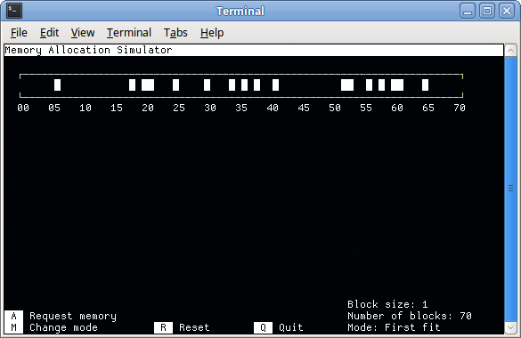

## Memory Allocation Simulator ##
**mem\_alloc\_sim** can simulate memory blocks being allocated by the operating system. Currently it supports first-fit, best-fit and worst-fit schemes.

### Installing and running ###
mem\_alloc\_sim is written in C and depends on ncurses.

    $ apt-get install libncurses5-dev
    $ make && make clean
    $ ./mem_alloc_sim

